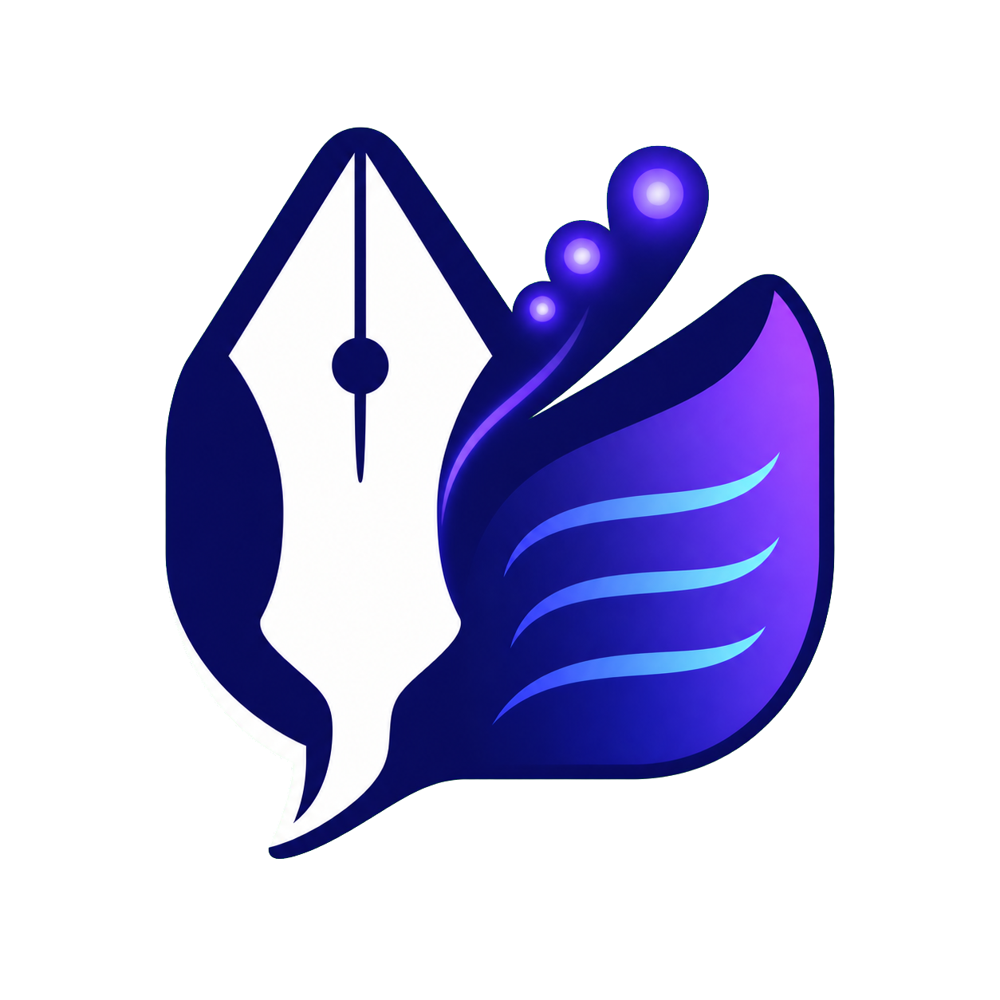

<p align="center" width="100%">

</p>

<h1 align="center">Writelong</h1>

<p align="center">
<b>Real autocomplete for macOS — powered by a local LLM, not a dictionary.</b>
</p>

<p align="center">
  <a href="https://github.com/Heer12354/Writelong/releases/latest"></a>
  <a href="LICENSE"></a>
  
  
  <a href="https://github.com/Heer12354/Writelong/releases/latest"></a>
</p>

<p align="center">
  <a href="https://github.com/Heer12354/Writelong/releases/latest">
    
  </a>
</p>

<p align="center">
  <a href="https://youtu.be/1huNPFQHqi8">
    
  </a>
</p>

---

**Writelong** watches the focused text field across any macOS app, predicts a short continuation at your cursor using a **local LLM**, and shows it as ghost text you accept with <kbd>Tab</kbd>. Nothing leaves your Mac.

It's a free, open-source, MIT-licensed alternative to the closed-source **Cotypist**.

## What's new

- **Safer diagnostics:** normal capture logs now contain structural metadata only, never the text,
  labels, window title, or domain from the field you are editing.
- **Clearer permissions:** onboarding explains why Accessibility is needed, what Writelong reads,
  and that captured writing is not sent to a server.
- **Auditable benchmarks:** published scoring definitions, suite sizes, result-history rules, and
  deterministic evaluation guidance.

## Privacy & permissions

Writelong runs its model locally. Accessibility lets it read the focused text field and caret
position to create a completion; it does not transmit captured text. Secure and password fields
are excluded. Writing-history personalization and clipboard context are local, user-controllable,
and enabled on new installs; screen/OCR context is off until enabled.

See [Privacy & Permissions](docs/10-privacy-and-permissions.md) for the full permission footprint,
data controls, and limitations.

## Benchmarks

The benchmark harness scores final visible behavior, not just raw model output. Its committed V1
public suites contain 1,208 cases: smoke (36), core (700), edge (300), policy (72), and latency
(100). `precisionWhenShown` is correct visible insertions divided by all visible suggestions;
`wrongShowRate` is wrong visible suggestions divided by all rows, so they are different metrics
with different denominators.

Results are deterministic for a fixed model, dataset, and configuration; they are not a guarantee
of real-world quality. The scoring rules, source selection, suite mix, and repeatable commands are
published in [Benchmark Dataset Curation](docs/09-benchmark-datasets.md).

## Contents

- [Why Writelong](#why-writelong)
- [Features](#features)
- [Models](#models)
- [Installation](#installation)
- [How it works](#how-it-works)
- [Development](#development)
- [Benchmarks](#benchmarks)
- [Roadmap](#roadmap)
- [Contributing](#contributing)
- [License](#license)

## Why Writelong

- 🔒 **100% on-device.** No API calls, no account, no server. Inference runs locally through `llama.cpp`.
- 🤫 **Suppression over slop.** Showing nothing beats showing a wrong, stale, or chatty suggestion — every candidate has to earn its place on screen.
- ✍️ **Continuation, not chat.** The prompt ends exactly at your cursor, so the model finishes *your* sentence instead of replying to it.
- ⚡ **Tuned for every keystroke.** Generation is cancellable and reuses KV-cache across keystrokes, so it doesn't lag behind you as you type.
- 🌍 **Language and RTL context capture.** The app detects language and writing direction per field;
  formal multilingual benchmark coverage is still in progress.

## Features

- **System-wide** ghost-text completion via the macOS Accessibility API — TextEdit, Mail, Slack, browsers, code editors, anywhere with a real text field.
- **Per-app policy engine** so insertion behaves correctly across very different apps, instead of one hack half-working everywhere.
- **Menu-bar app** — no dock icon, no window clutter.
- **Context you control**, in Settings → Privacy: writing history and clipboard context are on by default (encrypted, local); on-screen OCR context is opt-in, since it needs Screen Recording permission. One-tap "Clear all personal data."
- **Local personalization** — a privacy-preserving style fingerprint (counts and ratios only, never raw text) tunes suggestion confidence and timing to how you write.
- **Configurable keyboard shortcuts.**
- **Auto-updates** via a signed Sparkle appcast; ships as a notarized DMG.
- **Fully open-source**, MIT-licensed — read or change every line of the pipeline.

## Models

Pick one in onboarding or Settings, based on your Mac's memory and the quality/latency trade-off you want:

| Model | Size | Notes |
|---|---|---|
| Qwen3.5 0.8B Base | ~0.8 GB | Smallest, fastest — any Apple silicon Mac |
| **Qwen3.5 2B Base** | ~1.4 GB | **Recommended default** — balanced quality/speed |
| Qwen3.5 4B Base | ~2.6 GB | Higher quality, slower per token |
| Gemma 4 E2B | ~4.5 GB | Compact effective-2B Gemma |
| Gemma 4 E4B | ~5.0 GB | Largest Gemma — best quality, highest cost |
| LFM2.5 8B A1B Base | ~5.2 GB | Liquid AI MoE — needs 24 GB+ RAM |

All curated models are **base models**, not instruct/chat-tuned — deliberately, see [Why Writelong](#why-writelong). Weights download from Hugging Face on first launch, with an automatic mirror fallback if that host is unreachable.

## Installation

1. Download the latest DMG from [Releases](https://github.com/Heer12354/Writelong/releases).
2. Open `Writelong.dmg` and drag **Writelong** into **Applications**.
3. Open **Writelong** and finish onboarding — it asks for **Accessibility** permission (required) and downloads a model.

## How it works

```
Capture → Policy → Prompt → Model → Constrained Decode → Filter → Overlay → Tab-insert
```

Every keystroke: the Accessibility API captures your caret context → a per-app policy decides whether to even try → a budgeted prompt is built and sent to a local GGUF model over `llama.cpp` → decoding is constrained to admissible completions (no mid-word garbage, no duplicated suffixes) → the result is filtered against a suppression taxonomy → and only if everything passes, ghost text is drawn at the caret, ready to accept with `Tab`.

<details>
<summary><b>Repo layout</b></summary>

```
KeyType/
├── KeyType.xcworkspace/      ← open this in Xcode
├── KeyType.xcodeproj/
├── KeyType/                  ← app target (menu-bar shell)
├── KeyTypeTests/  KeyTypeUITests/
├── docs/                     ← project brief, playbooks, benchmarks, and privacy notes
└── Packages/                 ← local SwiftPM packages (the real logic)
    ├── AutocompleteCore/         shared domain types & protocols
    ├── MacContextCapture/        AX focus + caret + text-field snapshot
    ├── Prompting/                sectioned, budgeted prompt builder
    ├── ModelRuntime/             llama.cpp wrapper (load/tokenize/decode)
    ├── ConstrainedGeneration/    logit masking, trie admissibility, branch search
    ├── TokenProfiles/            ACPF format + reader
    ├── ProfileBuilder/           offline ACPF profile builder (acpf-build CLI)
    ├── ModelManagement/          model catalog, download, validation
    ├── CompletionUI/             overlay rendering (inline ghost text)
    ├── TextInsertion/            pasteboard / keystroke insertion strategies
    ├── AppCompatibility/         per-app / per-domain override policy
    ├── Personalization/          local writing-style profile, adaptive tuning
    └── KeyTypeBench/             internal quality/latency benchmark harness
```

</details>

## Development

Requirements: **macOS 14+** and a recent version of **Xcode**.

```sh
git clone https://github.com/Heer12354/Writelong.git
cd Writelong
open KeyType.xcworkspace
```

Build/run the **KeyType** scheme (the produced app is **Writelong**).

Per-package builds and tests:

```sh
swift build --package-path Packages/AutocompleteCore
swift test  --package-path Packages/Prompting
```

Every package under `Packages/` carries its own test suite — run `swift test` in a package after touching it.

## Benchmarks

Writelong ships its own eval harness, [`KeyTypeBench`](Packages/KeyTypeBench), scored against committed datasets (`smoke` / `core` / `edge` / `policy` / `latency`) covering code, CLI, browser forms, AI-chat UIs, abbreviations, and mid-word edits.

Latest run — recommended model (**Qwen3.5 2B**, Q4_K_M), hardest suite (**edge**, 300 cases), release build:

| Metric | Value |
|---|---|
| p50 latency | ~48 ms |
| p95 latency | ~86 ms |
| Precision when shown | 58% |
| Wrong-show rate | 18% |

Methodology and raw results live under `Packages/KeyTypeBench`. Numbers move as the model and pipeline change — treat this as a snapshot, not a promise.

## Roadmap

The core pipeline (capture → prompt → model → constrained decode → filter → overlay → insert) is **built and shipping** — see [`docs/04-roadmap.md`](docs/04-roadmap.md) for the full completed-milestone history and the live improvement backlog. Current work is quality, latency, and app-coverage iteration, not new construction.

## Contributing

Issues and PRs welcome — [bug report](.github/ISSUE_TEMPLATE/bug_report.md) and [feature request](.github/ISSUE_TEMPLATE/feature_request.md) templates are set up. Read [`docs/00-overview.md`](docs/00-overview.md) first; it's the source of truth for how the shipped system works.

## License

MIT — see [LICENSE](LICENSE).

---

<p align="center"><sub>A clean-room, open-source alternative to the closed-source <i>Cotypist</i>.</sub></p>
